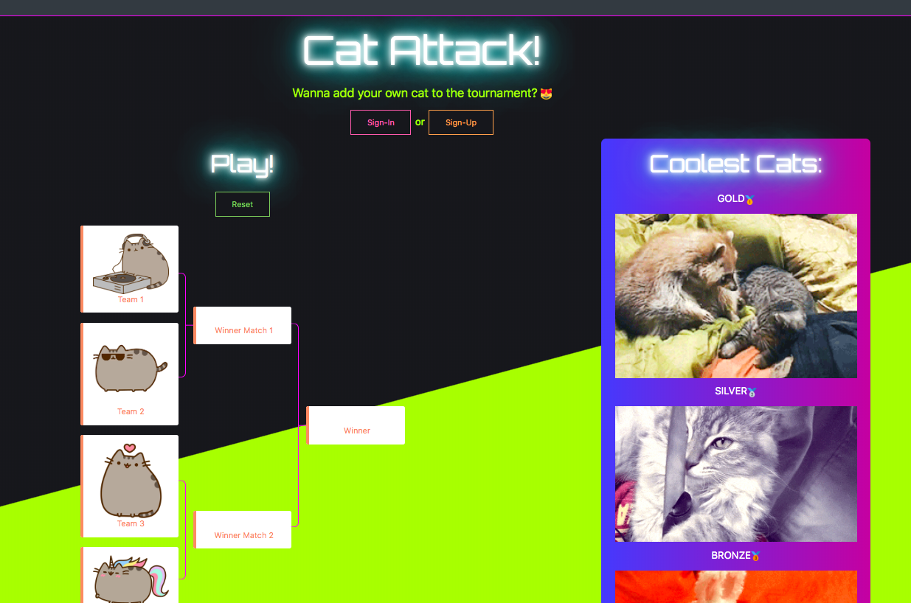

# Cat Attack!
It's well known that the internet is powered by cat memes/gifs. But finding the best cat gif out there? That's the challenge. We developed an app that allows users to essentially play March Madness with cat gifs to determine their favorites. Passport authentication allows users to sign-up/log-in and save their favorite gifs. Users can also add new cat gifs to the tournament. 

[Check out the app here](https://cat-attack1.herokuapp.com//)

## Requirements
* npm or yarn
* Node
* Terminal or bash

## built with
* passport.js
* Express
* Node
* Bootstrap
* mySQL
* Javascript/jQuery
* Giphy API
* HTML5
* CSS3

## Setup Instructions
1. clone the repo 
    * `git clone https://github.com/ksknight85/Project2`
    * `cd Project2`
2. install dependencies
    * `npm run install`
3. Start the development server
    * `npm run start`
4. Happy Hacking!

## Contributors
    Jenn Campbell
    Kevin Knight
    Dylan Le Clair
    Haley Brown
